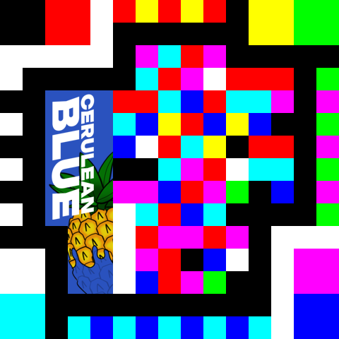
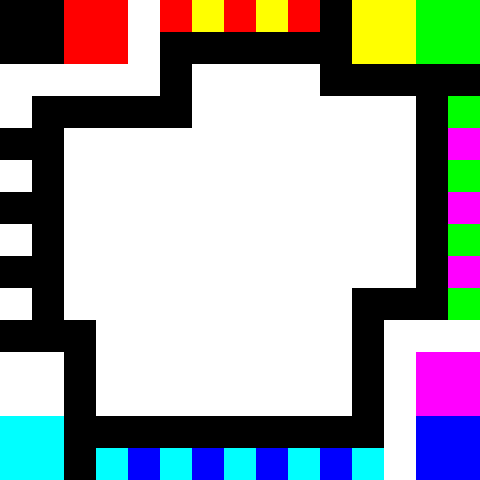
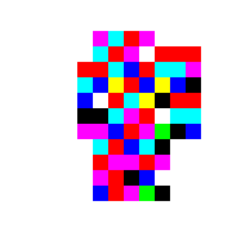
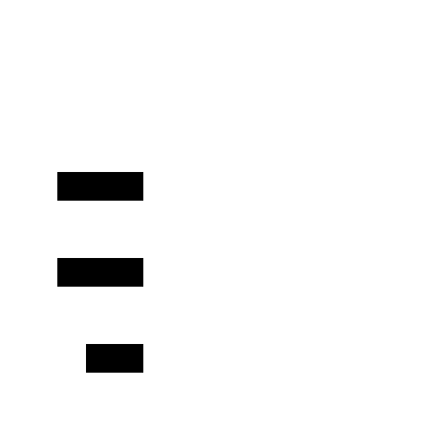
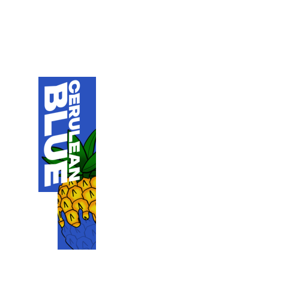

# Acorn Code

An Acorn Code is a [2D matrix code](https://en.wikipedia.org/wiki/Barcode#Matrix_(2D)_codes), like [QR Codes](https://en.wikipedia.org/wiki/QR_code), but that uses color in order to encode data into less space than through traditional black and white pixels.



This Acorn code is decorated with the Cerulean Blue logo, and decoding it (One pixel of data is 32x32) returns the Cerulean Blue website (https://cnblue.sting.lt/).


## What this repository contains

This repository contains two Python programs: one is a very featureful Acorn Code encoder (`encode.py`), and the other is a decoder for clean images of Acorn Codes (`decode.py`).
For help in using these programs, run `python3 encode.py --help` or `python3 decode.py --help`.

Please keep in mind that the decoder will only work with clean images of Acorn Codes: if it is an image taken from a camera, or transformed in any way, it will not decode the Acorn Code correctly.

---

Both of these programs can also be imported as Python modules: You can get the decoder with `from decode import decode` (where `decode` has to be ran as `decode(img, scale*)`). You can also name `decode` something else by importing the function with an alias (`from decode import decode as function_name`).

The same applies to `encode`, where `encode` has to be ran as `encode(content, scale*, ratio*, requested_width*, requested_height*, reserve_unused*, transparent_unused*, showProgress*)` where `showProgress` is a callback function with 2 arguments (`idx` and `length`) where the percentage can be calculated from `idx/length*100`.

`*` means that the argument is optional.


## Parts of an Acorn Code

### Alignment patterns



The alignment patterns are at the boundaries of the matrix code, and they are for identifying if the code is an Acorn Code, and are meant to work the same way as the Finder patterns, Alignment patterns and Timing patterns of a QR Code. This will become very helpful for a decoder for unclean images of Acorn Codes.

### Data (used)



The order of the data is from top to bottom, then from right to left. It uses the most available space on the matrix without touching the alignment patterns.

The data is encoded into octants (`test` turns into `164 145 163 164` then `164145163164`), then every digit turns into a pixel using this color table:
```
0: #000000 (black)
1: #ff0000 (red)
2: #00ff00 (green)
3: #ffff00 (yellow)
4: #0000ff (blue)
5: #ff00ff (magenta)
6: #00ffff (cyan)
7: #ffffff (white)
```

### Data (EOF + Unused)



This uses the same orientation rules as data.

The EOF marker is 3 white pixels that mark the end of data, and it is required for every Acorn Code. What's right after is completely ignored, so it can either be a pattern (see image above) or contain images/decorations (see image below):



The EOF marker can also be helpful when making an Acorn Code by hand (considering there was a time where an Acorn encoder didn't exist yet).